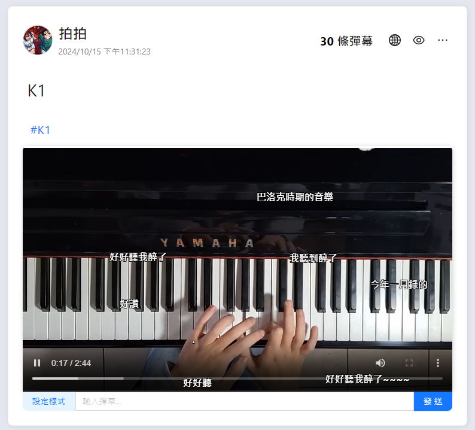
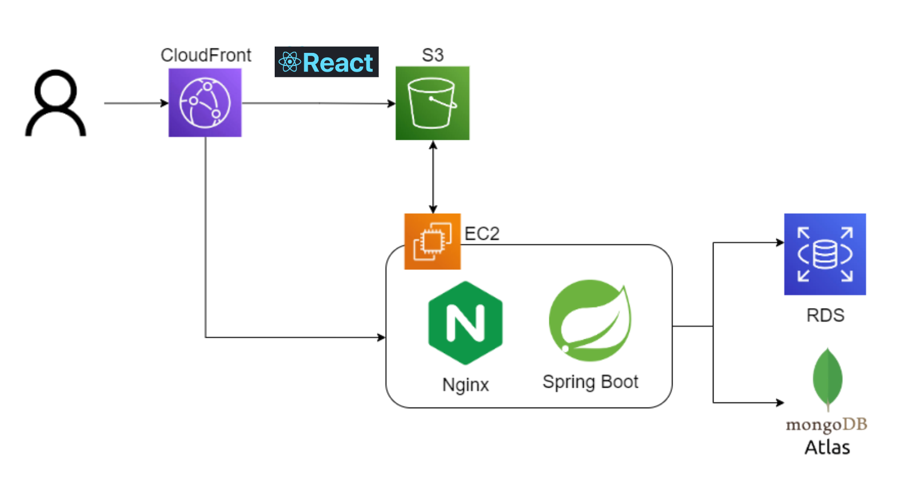

# Nekoo

### [nekoo.xyz](https://nekoo.xyz/)

A Danmaku social media.

### Account

You can signup a new one, or use

* email: `nobi@gmail.com`
* passwd: `asdfasdf`

## Description

Nekoo give user an interesting way to interact others.
Nekoo Post supports uploading image/video.
User can leave comment(Danmaku), make the post richer comment.

## Architecture

* Separation of Frontend & Backend
    * Frontend made by React and host at S3 bucket
    * Backend made by Spring Boot
    * Database use hybrid format, RDS(MySQL) and MongoDB Atlas

